# یادگیری کانجی های ژاپنی

توی این بخش میخوام در مورد اینکه چطور با استفاده از رادیکال ها، کانجی ها رو یاد بگیریم صحبت کنم. توی قسمت قبلی دسته بندی ای انواع کانجی ها رو گفتم و فهمیدیم که بیشتر کانجی ها رادیکال دارن. این نکته رو الان اضاف میکنم که تعداد این رادیکال ها در هر کانجی میتونه از 1 عدد تا 3 عدد باشه ولی تا 4 عدد هم داریم پس در جریان باشید. یه نکته دیگه: در مورد کانجی ها 0 و 100 نداریم. استثنا داریم که سعی میکنم ذکر کنم و تقصیر منم نیست خدا میدونه.

## دو روش برای یادگیری به واسطه کانجی ها داریم:

اولین روش اینه که اسم تمام رادیکال ها رو یاد بگیرید قبل از اینکه به سراغ کانجی ها برید. این روش در ابتدا آهسته است ولی بعدا سرعت بیشتری به همراه داره. (پیشنهاد خودم)
دومین روش اینه که برای 10 تا 30 کانجی شروع به شناسایی رادیکال ها کنید. برای هر کانجی اون رادیکالها رو یاد بگیرید بعد شروع به یادگیری معنای کانجی به واسطه رادیکال ها کنید و همین کار رو برای 10 تا 30 تا بعدی تکرار کنید و برید جلو...
به سایت [Jisho](https://jisho.org/) برید و کانجی یا رادیکال مورد نظرتون رو با قرار دادن علامت * در دو طرفش، جستجو کنید و توی نتایج ببینید که کدوم تلفظ بیشترین مصرف رو داره و از همون برای خوندن کانجی یا رادیکال استفاده کنید. اگر نتونستید سر در بیارید از نوع On استفاده کنید. اگر بیش از یک On داشت بازم دنبال بیشترین مصرف بگردید. باقی روش های خوندن رو وقتی با vocab شروع کنید یاد میگیرید الان زوده.

## اجزای رادیکال ها

در یادگیری رادیکال ها، آنالیز و درک ترکیب بندی های کاراکتر های کانجی مفیده. شاید وحشت کنید ولی در مورد کانجی ها یه سری اجزای کوچکتر از رادیکال ها هم داریم که درکشون بسیار مفیده. (امیدوارم این آخریش باشه 😥). این جزء های کوچکتر همون خطوط هستن. با انواعشون، جهت، نحوه نوشتار، ترتیب و نحوه شمارش خطوط در رادیکال ها و کانجی آشنا میشیم. (یعنی باید بشیم 😅)

## انواع خطوط ikkaku 一画

### خطوط رو به هشت گروه اصلی تقسیم میکنیم:

|     نام     |                      توضیحات |
| :---------: | ---------------------------: |
|     ten     |               ضربه های کوتاه |
|  yoko sen   |                    خطوط افقی |
|  tate sen   |                   خطوط عمودی |
| naname sen  |                    خطوط مورب |
|  kado kagi  |                         گوشه |
| naname kagi |                مورب زاویه ای |
|   magari    |                        منحنی |
|    ahiru    | مورب زاویه ای همراه با منحنی |

از این انواع خطوط بسته به نحوه خاتمه دادن هم دسته بندی داریم. (**نکته مهم:** *این ها همگی در خطاطی ژاپنی و چینی قابل مشاهده هستن و اصلا جز مهارت و اساس هستن ولی شما برای نوشتار با خودکار و مداد و این وسایل یه سختی میتونید این شکل ها رو ایجاد کنید پس نگران نباشید و فقط یه صورت اطلاعات عمومی بهشون نگاه کنید. مگر اینکه بخواین خطاطی هم یاد بگیرید که اینا میشن اصل کار*) در کل 4 نوع پایان برای خطوط وجود داره:

1. **ایست Stop:** بایستی قلم در آخر کاملا متوقف بشه بعد از روی کاغذ بلند بشه.

2. **پرش Jump:** در آخر به سرعت قلم رو بر میداریم.

3. **لغزاندن Sweep:** بایستی به آرامی در طول حرکت قلم برداشته بشه تا ارزش خطی به وجود بیاره.

4. **ایست و لغزش　Stop-Sweep:** بایستی قلم ایست کامل کنه و قبل از برداشتن به واسطه ی لغزش به صورت موازی به پایین و راست بره.

   **(توی کتابایی که بهتون میدم شمایل رو کامل میتونید ببینید.)**

## قوانین پایه ترتیب خطوط:

انواع خطوط رو شناختیم، حالا باید بدونیم ترتیب درست نوشتن هر خط چیه. خطوط اصولا در ریتم خاصی هستند که اغلب هر خط به واسطه حرکت خط قبلی شکل میگیره. (*به شماره ها توجه کنید*)

1. کانجی ها از چپ به راست ترسیم یا نوشته میشن.

   

2. کانجی ها از بالا به پایین نوشته میشن.

   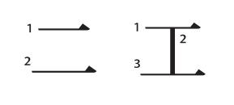

3. معمولا خطوط افقی yoko sen قبل از خطوط عمودی tate sen ترسیم میشن حتی اگر خط عمودی منحنی باشه. (**استثنا هایی هم داریم**)

   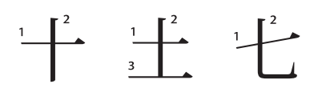

   استثنا:

   

4. زمانی که کاراکتر کانجی به نوعی قرینه است، از وسط شروع میکنیم، بهد به سمت چپ و بعد به سمت راست میریم.

   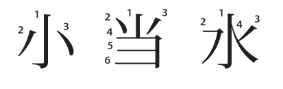

   استثنا:

   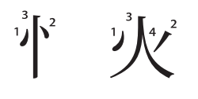

5. ابتدا اطراف کاراکتر به جز خط پایینی ترسیم میشه و قبل از شکل میانی.

   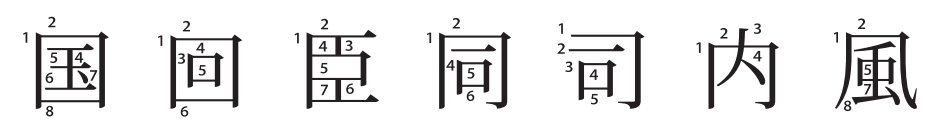

   استثنا:

   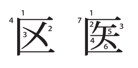

6. خط مورب لغزشی به سمت چپ قبل از خط مورب توقفی سمت راست نوشته میشه.

   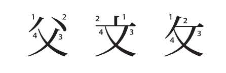

7. خط میانی عمودی tate sen که از میان کاراکتر عبور میکنه، در آخر ترسیم میشه.

   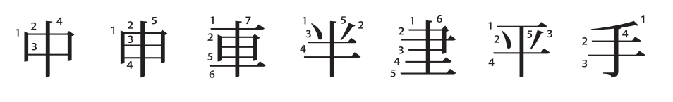

8. خط میانی افقی yoko sen که از میان کاراکتر عبور میکنه در آخر ترسیم میشه.

   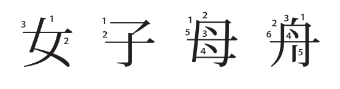

9. قسمت پایین سمت چپ رو آخر ترسیم میکنیم.

   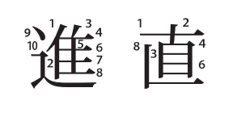

خب این جلسه کلی مطلب در مورد المان های بصری داشتیم. مطالب زیاده و نوشتنشون توی یه بخش زمانبره و خداییش منم کیبورد فارسی ندارم و نمیدونید چقدر دردسره این فارسی نوشتن. اشتباه تایپیه اگه قابل تشخیص نبودن بهم بگید (باقی رو که متوجه میشید نمیخواد بگین 😉)

توی جلسه بعدی کلا میرم سراغ رادیکال ها و زودتر هم منتشرش میکنم. خیالتون راحت. امیدوارم کارایی که بهتون گفتم رو تا اینجا با دیسیپلین شروع کرده باشین. ژاپن به دیسیپلین معروفه، زبانشم همینه، اگر روزی هم برید ژاپن بخواین راحت باشین باید آدم دیسیپلین داری باشید. بهونه ها رو بندازید دور و شروع کنید با برنامه هر روز حتی اگر طوفان میومد قطعش نکنید. برای خودتونه.
**دوستتون دارم.**😘😘😘😘

کد زیر رو برای ورود به کانال آموزش زبان ژاپنی اسکن کنید.

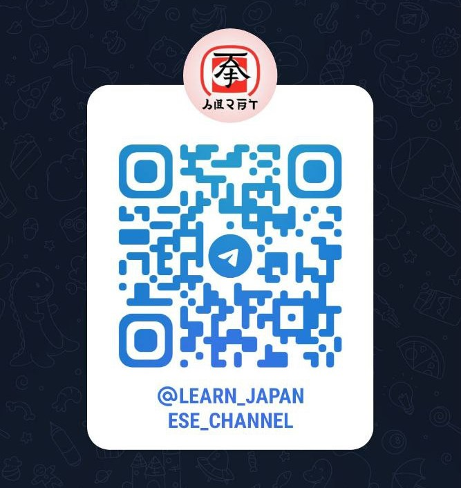

